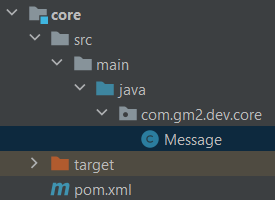

# Projeto base para aplicações modularizadas em java
Modularização de projetos java - base

### 1 - Início
- Criar a pasta do projeto;
- Neste exemplo chamei de _java-module-base_.

### 2 - Criar o projeto _api_
- O móludo _Api_ é uma projeto String Boot;

### 3 - Crir projeto _core_
 A ideia do projeto _core_ é de compartilhar o código que será usado em outros módulos, como por exemplo: DTO's, entidades, repositories, dentre outros.

- O projeto _core_ possui apenas uma classe para testar a modularização;
- Clique com botão direito em _java-module-base_ -> New -> Module;


- Selecione o template _Maven Archetype_;
- Em _name_ especifique o nome do projeto;
- _Parent_ __None__
- Em _Archetype_ adicione uma nova com as configurações necessárias (ver imagem);

 

- O projeto _core_ deve possuir um arquivo _pom.xml_ com as configurações abaixo:
```
<?xml version="1.0" encoding="UTF-8"?>
<project xmlns="http://maven.apache.org/POM/4.0.0"
         xmlns:xsi="http://www.w3.org/2001/XMLSchema-instance"
         xsi:schemaLocation="http://maven.apache.org/POM/4.0.0 http://maven.apache.org/xsd/maven-4.0.0.xsd">

    <modelVersion>4.0.0</modelVersion>
    <groupId>com.gm2.dev</groupId>
    <artifactId>core</artifactId>
    <version>1.0</version>

    <properties>
        <maven.compiler.source>19</maven.compiler.source>
        <maven.compiler.target>19</maven.compiler.target>
        <project.build.sourceEncoding>UTF-8</project.build.sourceEncoding>
    </properties>

</project>
```
- Crie um packege __com.dgm2.dev.core__



- Por fim, crie uma classe para testar o compartilhamento de código:

```
package com.gm2.dev.core;

public class Message {

    public String get(){
        return "Mensagem do módulo Core";
    }
}
```

### 4 - Modularizar a solução
- Na raiz da pasta do projeto _java-module-base_, crie um arquivo __pom.xml__ e configure conforme apresentado abaixo:
```
<project xmlns="http://maven.apache.org/POM/4.0.0"
         xmlns:xsi="http://www.w3.org/2001/XMLSchema-instance"
         xsi:schemaLocation="http://maven.apache.org/POM/4.0.0 http://maven.apache.org/xsd/maven-4.0.0.xsd">
    <modelVersion>4.0.0</modelVersion>
    <groupId>com.gm2.dev</groupId>
    <artifactId>gm2.dev</artifactId>
    <version>1.0</version>
    <packaging>pom</packaging>

    <modules>
        <module>api</module>
        <module>core</module>
    </modules>

</project>
```
### 5 - Importar o projeto _core_ na _api_

- Para o projeto _api_ realizar o scan das classes do projeto, é necessário adicionar a annotation __@ComponentScan__ apontando para o packege principal do módulo _core_ ({"com.gm2.dev.core"}).
```
@SpringBootApplication
@ComponentScan({"com.gm2.dev.core"})
public class ApiApplication {

    public static void main(String[] args) {
        Message message = new Message();
        System.out.println(message.get());
        SpringApplication.run(ApiApplication.class, args);
    }
}
```
